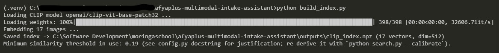
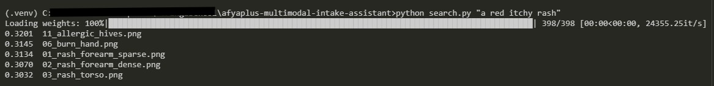
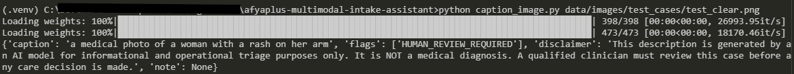
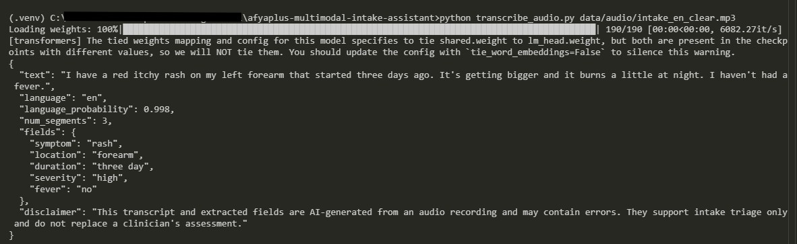
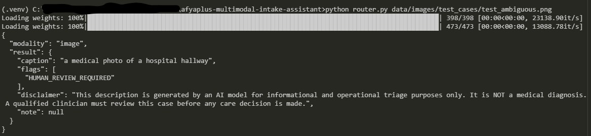
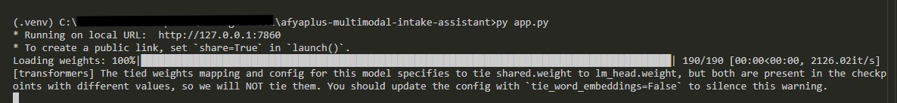
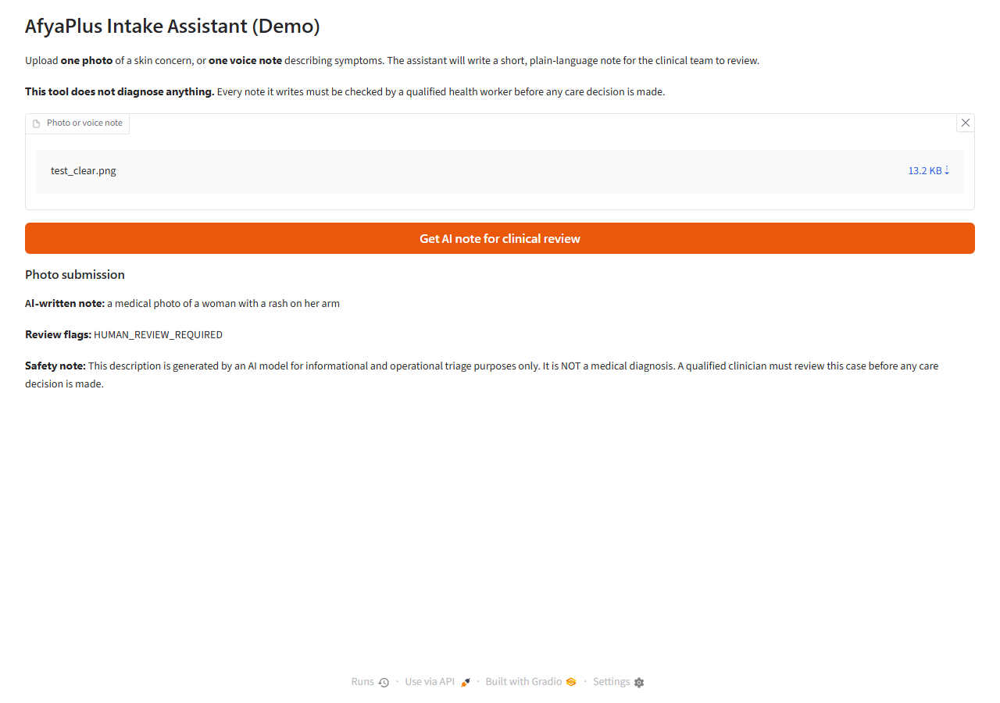
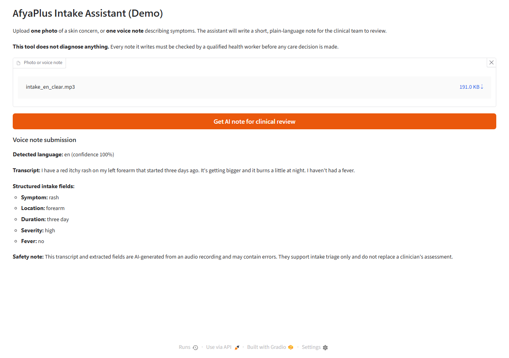

# AfyaPlus Multimodal Intake Assistant

## Overview

A multimodal patient-intake pipeline for the AfyaPlus health scenario. A
user submits either a **photo** of a skin concern or a **voice note**
describing symptoms; the system routes it automatically and returns a
short, plain-language note for a clinician to review -- never a diagnosis.

Three capabilities, tied together by one router and one Gradio app:

1. **Retrieval** -- CLIP semantic search over a library of intake photos
   ("have we seen something like this before?").
2. **Captioning** -- turns a photo into a short written note, with
   mandatory disclaimers and automatic flagging of unreadable or
   out-of-scope images.
3. **Transcription** -- turns a voice note into a transcript plus
   structured fields (symptom, location, duration, severity, fever).

**Architecture:** see [`docs/architecture.md`](docs/architecture.md) for
detailed Mermaid diagrams -- component overview, the image and audio
request-flow sequence diagrams, the offline index-build vs. query-time
retrieval flow, and the optional API-comparison path.

**Presentation:** [view the project presentation](https://docs.google.com/presentation/d/e/2PACX-1vTAQMmBYAS9bssLnU2nh52F1UCQrZ_k8jn7igQde3gTXPWJz6KZ6JF1dpdxv5LjajfhdV2JXCbYiVge/pub?start=false&loop=false&delayms=3000)
-- deliverable walkthrough, the fever-detection bug found via live testing,
honest limitations, real API-vs-local cost/quality data, and the final
recommendation.

## Tech stack

| Layer | Choice |
|---|---|
| Language | Python 3.14 |
| ML framework | PyTorch 2.13 (CPU build) |
| Model hub / inference | Hugging Face `transformers` 5.16 |
| Retrieval | CLIP (`openai/clip-vit-base-patch32`) |
| Captioning | BLIP (`Salesforce/blip-image-captioning-base`) |
| Speech-to-text | `faster-whisper` 1.2 (CTranslate2, int8, CPU) |
| Field extraction | `google/flan-t5-small` + regex fallback |
| UI | Gradio 6.26 |
| Image I/O | Pillow |
| Numerics | NumPy (index storage/search) |
| Audio I/O | `soundfile`, `sentencepiece` (tokenization) |

See [`requirements.txt`](requirements.txt) for the pinned dependency list.

## API vs local fallback

**This project ships the local/open-source fallback path, not the OpenAI
API.** Normal operation (building the index, running the app, running
`evaluate.py`) spends no OpenAI credits. Every model below runs on CPU with
no network calls at inference time (aside from the one-time Hugging Face
download the first time you run each script):

| Capability | OpenAI path | Local path (shipped here) |
|---|---|---|
| Retrieval | CLIP (same either way) | `openai/clip-vit-base-patch32` via `transformers` |
| Captioning | GPT-4o vision | `Salesforce/blip-image-captioning-base` |
| Transcription | Whisper API | `faster-whisper` ("base" size, CTranslate2, int8) |
| Field extraction | GPT-4o | `google/flan-t5-small` + a regex safety-net |

All safety behaviour required by the rubric -- disclaimers, `UNREADABLE`,
`OUT_OF_SCOPE`, and `HUMAN_REVIEW_REQUIRED` flags, and confidence thresholds
-- is implemented regardless of which model produced the caption or
transcript. See [`config.py`](config.py) for the exact flag/threshold
definitions.

**Side-by-side comparison:** [`compare_api_vs_local.py`](compare_api_vs_local.py)
is a deliberate, one-time, opt-in exception that actually calls the OpenAI
API (GPT-4o-mini vision + Whisper API) on the same test fixtures, so the
tradeoff above is backed by real output rather than an assumption. Results:
[`docs/api_vs_local_comparison.md`](docs/api_vs_local_comparison.md).
Requires `pip install -r requirements-compare.txt` and an `OPENAI_API_KEY`
in `.env`; not needed to run the shipped app. Copy
[`.env.example`](.env.example) to `.env` and fill in your key --
`.env` itself is gitignored and never committed.

**Real cost data:** [`docs/cost_analysis.md`](docs/cost_analysis.md) uses
the actual OpenAI billing export from running the comparison above
([`completions_usage_2026-08-01_2026-08-31.csv`](completions_usage_2026-08-01_2026-08-31.csv),
[`cost_2026-08-01_2026-08-31.csv`](cost_2026-08-01_2026-08-31.csv)) to show
what was really spent and to project the cost of this workload at 1000
requests (≈ $0.68-$0.85/month) against the local path's $0 marginal
per-request cost.

## Rubric compliance

| Criterion | Where it's satisfied |
|---|---|
| **Retrieval index** (17 images, ranked results, threshold justified) | [`build_index.py`](build_index.py) + [`search.py`](search.py); threshold derivation documented in [`config.py`](config.py); `python search.py --calibrate` reproduces it; CLI proof: [`screenshots/cli_build_index.jpg`](screenshots/cli_build_index.jpg), [`screenshots/cli_search.jpg`](screenshots/cli_search.jpg). Known limitation: [`docs/evaluation_table.md`](docs/evaluation_table.md#notes-and-limitations) |
| **Captioning** (all 3 cases, safety constraints every response) | [`caption_image.py`](caption_image.py); all 3 cases (clear/ambiguous/out_of_scope) exercised in [`docs/evaluation_table.md`](docs/evaluation_table.md#captioning-safety-flag-detail) with flags + disclaimer on every response; CLI proof: [`screenshots/cli_caption_image.jpg`](screenshots/cli_caption_image.jpg) |
| **Transcription** (accurate transcript, fields extracted correctly) | [`transcribe_audio.py`](transcribe_audio.py) + [`extract_fields.py`](extract_fields.py); accuracy check + accented-voice robustness check in [`docs/evaluation_table.md`](docs/evaluation_table.md#transcription-accuracy-check); CLI proof: [`screenshots/cli_transcribe_audio.jpg`](screenshots/cli_transcribe_audio.jpg) |
| **Gradio app** (router + UI work for both file types, clearly labelled) | [`router.py`](router.py) + [`app.py`](app.py); both file types demonstrated in [`screenshots/image_result.png`](screenshots/image_result.png) and [`screenshots/audio_result.png`](screenshots/audio_result.png); CLI proof: [`screenshots/cli_router.jpg`](screenshots/cli_router.jpg), [`screenshots/cli_app_launch.jpg`](screenshots/cli_app_launch.jpg) |
| **Evaluation & memo** (jargon-free memo, specific justified recommendation backed by the table) | [`docs/business_memo.md`](docs/business_memo.md) (recommendation: pilot as a staff-only drafting aid, one clinic, one month) backed by [`docs/evaluation_table.md`](docs/evaluation_table.md), generated by [`evaluate.py`](evaluate.py); real OpenAI-API-vs-local comparison in [`docs/api_vs_local_comparison.md`](docs/api_vs_local_comparison.md); real billing data + 1000-request cost projection in [`docs/cost_analysis.md`](docs/cost_analysis.md) |

## Why the sample data is synthetic, not real patient data

The capstone brief is explicit that this is a *pre-production* exercise --
the whole point is to get a documented, evaluated system in place *before*
real patient data is involved. Using real clinical photographs or patient
recordings here would require consent and PHI handling this project
doesn't have. Instead:

- `data/images/index/` holds 17 simple, clearly-synthetic images covering
  rash, bruise, burn, wound, swelling, insect bite, hives, eye redness,
  mole, infection, ulcer, and skin discoloration -- enough consistent
  visual structure (color, shape, texture) for CLIP/BLIP to distinguish
  between categories, without touching real patient data.
  `data/images/test_cases/` holds 3 additional images (clear, ambiguous,
  out-of-scope) used only to exercise the captioning safety paths.
- `data/audio/` contains two English intake voice notes synthesized with
  ElevenLabs TTS: `intake_en_clear.mp3` (clear voice, used as the accuracy
  baseline) and `intake_en_accented.mp3` (accented voice, used to check
  transcription robustness to speaker variation).

> **Before judging any caption or search result, open the images yourself**
> ([`data/images/index/`](data/images/index/),
> [`data/images/test_cases/`](data/images/test_cases/)). They're simple
> synthetic drawings, not photographs -- captions and similarity scores
> should be read against what the image actually looks like, not against
> what its filename implies. This also explains the retrieval-ranking
> limitation noted below: some of these images are visually closer to each
> other than their category labels suggest.

This is called out again in [`docs/evaluation_table.md`](docs/evaluation_table.md)
as a limitation on caption/transcript *accuracy* and retrieval ranking
*precision* (the safety *behaviour* is still fully exercised) and in
[`docs/business_memo.md`](docs/business_memo.md) as a named risk to manage
before any real-data pilot.

## Project structure

```
.env.example                      Template for .env (only OPENAI_API_KEY, only needed for step 7 below)
config.py                         Central paths, model names, thresholds, disclaimer text
build_index.py                    Deliverable 1: builds the CLIP index over data/images/index/
search.py                         Deliverable 1: search(query, top_k), find_duplicates(), --calibrate
caption_image.py                  Deliverable 2: BLIP captioning + safety flags
transcribe_audio.py               Deliverable 3: faster-whisper transcription + long-audio chunking
extract_fields.py                 Deliverable 3: structured JSON field extraction
router.py                         Deliverable 4: dispatches a file to the image or audio pipeline
app.py                            Deliverable 4: Gradio app
evaluate.py                       Deliverable 5: runs all pipelines, writes docs/evaluation_table.md
compare_api_vs_local.py           Optional: real OpenAI-API-vs-local comparison (spends API credit)
data/images/index/                17 synthetic images used to build the retrieval index
data/images/test_cases/           3 captioning test cases: clear, ambiguous, out_of_scope
data/audio/                       Sample voice notes (ElevenLabs TTS: clear + accented English)
docs/architecture.md              Mermaid architecture diagrams (component + sequence + data flow)
docs/evaluation_table.md          Deliverable 5: before/after evaluation table
docs/business_memo.md             Deliverable 5: one-page stakeholder memo
docs/api_vs_local_comparison.md   Output of compare_api_vs_local.py
docs/cost_analysis.md             Real billing data + 1000-request cost projection
completions_usage_*.csv           Raw OpenAI token-usage export (source data for cost_analysis.md)
cost_*.csv                        Raw OpenAI billing export (source data for cost_analysis.md)
screenshots/                      CLI proof screenshots + Gradio app screenshots (see below)
```

## How to reproduce

Each step below includes a terminal screenshot from an actual run of that
exact command, as proof it works end to end on a real machine, not just in
theory. Full-size originals: [`screenshots/`](screenshots/).

**1. Environment setup** (Python 3.10+; CPU only, no GPU required)

```bash
python -m venv .venv
.venv\Scripts\activate            # Windows
pip install -r requirements.txt
```

**2. Sample data** -- already committed under `data/`: 17 synthetic index
images + 3 test-case images, plus 2 ElevenLabs TTS voice notes. Nothing to
generate; skip straight to building the index.

**3. Build the retrieval index**

```bash
python build_index.py
```



**4. Try each pipeline directly**

```bash
python search.py "a red itchy rash"
```



```bash
python caption_image.py data/images/test_cases/test_clear.png
```



```bash
python transcribe_audio.py data/audio/intake_en_clear.mp3
```



```bash
python router.py data/images/test_cases/test_ambiguous.png
```



**5. Run the evaluation** (writes `docs/evaluation_table.md`)

```bash
python evaluate.py
```

**6. Launch the app**

```bash
python app.py
# open the printed local URL (default http://127.0.0.1:7860), upload a
# sample image or audio file from data/ and review the result.
```



**7. (Optional, spends real OpenAI credit) Real API-vs-local comparison**

```bash
pip install -r requirements-compare.txt
cp .env.example .env               # then edit .env with your real key
python compare_api_vs_local.py
```

The first run of each script downloads its model from Hugging Face
(cached under `~/.cache/huggingface`); total download size is roughly
2 GB across all four models. Budget a few minutes on first run.

## Safety note

Image captions and voice-note transcripts produced by this system are
**informational and operational only -- they are not a medical diagnosis.**
Every caption and transcript carries a disclaimer to this effect
(`config.CAPTION_DISCLAIMER`, `config.TRANSCRIPT_DISCLAIMER`), and any input
the system isn't confident about is flagged for human review
(`HUMAN_REVIEW_REQUIRED`, `UNREADABLE`, `OUT_OF_SCOPE`) rather than given a
guessed answer. See [`docs/business_memo.md`](docs/business_memo.md) for the
full risk/mitigation discussion.

## Screenshots

All screenshots live in [`screenshots/`](screenshots/). CLI proof
screenshots (`cli_*.jpg`) are embedded inline above, next to the command
each one proves; the Gradio app screenshots are below.

**Gradio app -- photo submission** (`test_clear.png`):



**Gradio app -- voice note submission** (`intake_en_clear.mp3`):


