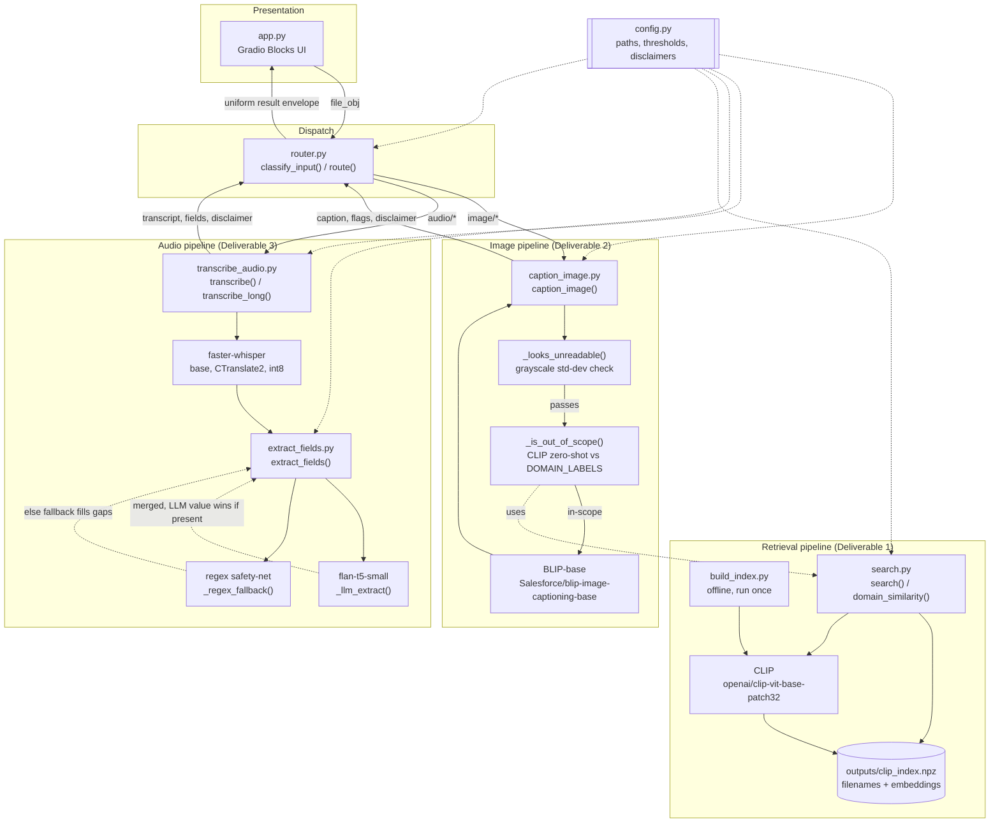
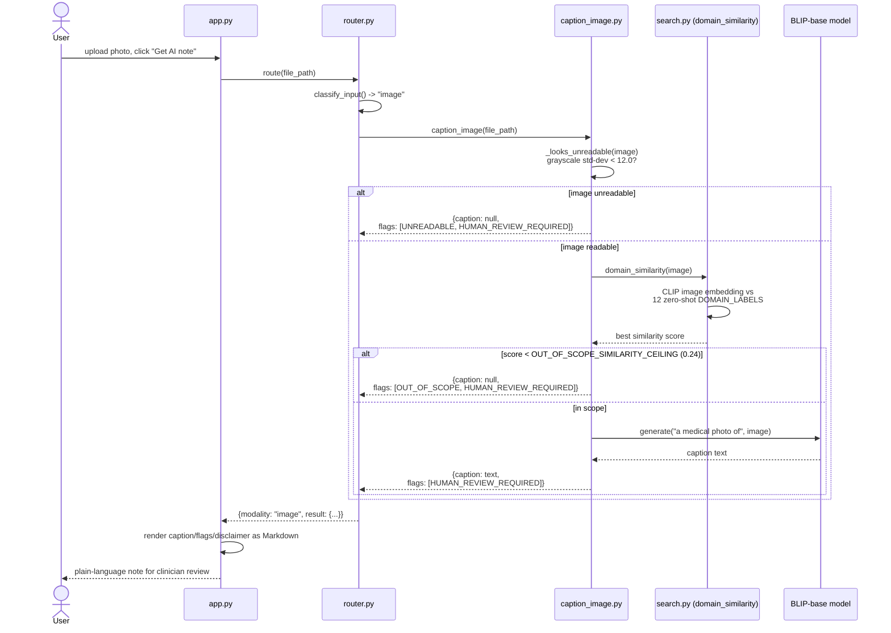
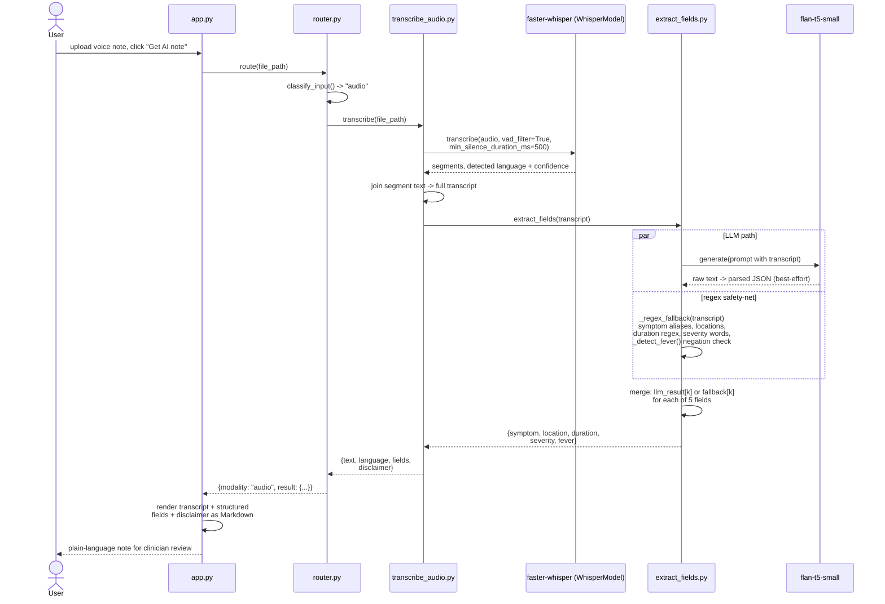
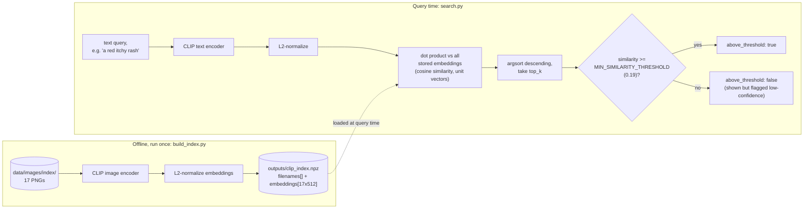
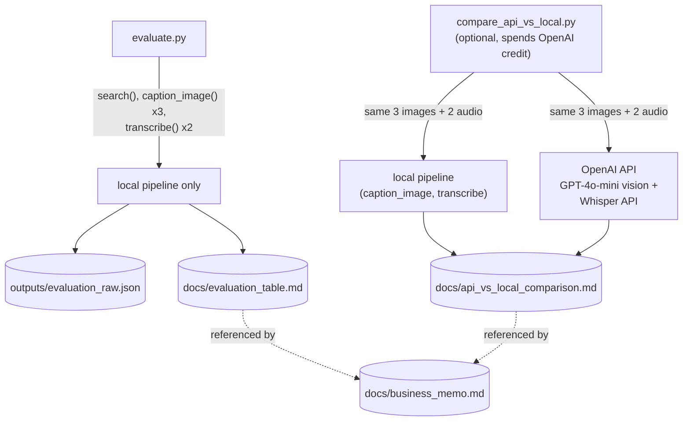

# Architecture

This document describes how the AfyaPlus Multimodal Intake Assistant is
put together: the runtime request path, the offline retrieval-index build,
the internal decision logic inside captioning/transcription, and the
optional API-comparison path. See [`../README.md`](../README.md) for setup
and the top-level pipeline summary, and [`../config.py`](../config.py) for
every constant referenced below.

## 1. Component overview

Everything funnels through one router and one Gradio app. `config.py` is
the single source of truth for paths, model names, thresholds, and
disclaimer text -- every module below imports it rather than hardcoding
any of those values.

## 2. Request flow: photo submission

Every branch -- unreadable, out-of-scope, or a successful caption -- always
carries `config.CAPTION_DISCLAIMER` and always sets
`HUMAN_REVIEW_REQUIRED`; nothing is ever shown without both.

## 3. Request flow: voice note submission

`_detect_fever()` specifically guards against a real bug class: a naive
`"fever" in text` check would flip "I haven't had a fever" to a positive
fever flag. It scans a window before the word "fever" for negation cues
(`no`, `not`, `n't`, `without`, `denies`) before deciding yes/no.

## 4. Retrieval: offline index build vs. query time

`MIN_SIMILARITY_THRESHOLD` (0.19) and `OUT_OF_SCOPE_SIMILARITY_CEILING`
(0.24, used by the captioning pipeline's `domain_similarity` check) are
both empirically calibrated by `python search.py --calibrate` against this
specific 17-image index -- see the docstring comments in
[`../config.py`](../config.py) for the exact relevant/irrelevant score
spread that justified each number. Both numbers are index-dependent and
should be re-derived if the index images change.

## 5. Evaluation and the optional API-comparison path

`evaluate.py` is part of the normal, no-API-key-needed workflow.
`compare_api_vs_local.py` is a separate, explicitly opt-in script (see
README "API vs local fallback") that requires `OPENAI_API_KEY` in `.env`
and is not on the path of any other script -- nothing else imports it or
depends on its output.

## 6. Design principles this diagram is enforcing

- **Single source of config.** Every threshold, path, and disclaimer
  string lives in [`../config.py`](../config.py); no module hardcodes its
  own copy, so calibration stays in one place.
- **Fail toward a human, not a guess.** Both pipelines are structured so
  every early-exit branch (`UNREADABLE`, `OUT_OF_SCOPE`) and every
  successful branch alike ends with `HUMAN_REVIEW_REQUIRED` plus a fixed
  disclaimer -- there is no code path that returns a caption or transcript
  without both.
- **LLM output is never trusted alone.** `extract_fields.py` always runs
  the regex fallback alongside the flan-t5-small call and merges field-by-
  field, so a field the model hallucinates away (or gets wrong) can still
  be recovered from the raw transcript text.
- **Local is the default; API is opt-in and isolated.** Only
  `compare_api_vs_local.py` touches the network/OpenAI; every other script
  in the request path (`router.py`, `app.py`, `evaluate.py`) is fully
  local/offline after the one-time Hugging Face model download.
